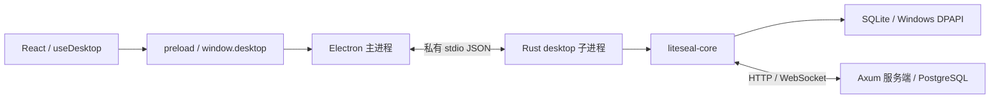

# Electron 桌面架构

## 分层与接口



`electron/contracts.ts` 定义全部 39 个桌面命令的参数和结果类型，preload 为每个命令暴露单独方法，页面不能访问通用 ipcRenderer、文件系统或进程启动器。私钥只保存在 Rust 子进程：`prepare_identity`、`load_identity`、`save_session` 只向页面返回公钥与会话字段，`encrypt_message`、`decrypt_message`、`sign_message` 使用子进程保存的身份，不接受也不返回私钥。`useDesktop` 保持页面原有调用方式；联系人添加返回 `{ success: boolean }`，删除和信任更新的 hook 丢弃成功结果返回 void。

Rust 的 `desktop/src/protocol.rs` 使用 serde 枚举分发所有命令，并验证字段类型、必填项、未知字段及字节范围。顶层参数沿用 camelCase，嵌套业务模型和结果沿用核心的 snake_case；`Vec<u8>` 对应 JSON 数字数组，空返回值对应 null，错误转换为前端 Error。

功能包括注册/邀请码验证、登录/刷新、中继连接/断开、发送/轮询/本地历史、加密/解密/签名/验签/密钥生成、联系人增删/列表/信任、用户搜索/设备查询、存储统计/清理、密钥保存/读取/删除。确认密码及表单提示灯继续由前端处理。

## stdio 协议与生命周期

每条消息为 UTF-8 JSON，以换行结束；stdout 只用于协议，Rust 日志发往 stderr。Electron 消费并丢弃 stderr，避免请求和远端错误意外进入页面或生产日志；调试业务失败时使用命令返回的错误。示例：

```json
{"ready":true,"version":1}
{"id":1,"command":{"name":"get_contacts","args":{}}}
{"id":1,"result":[]}
{"id":2,"error":"Invalid command or arguments"}
```

首次消息必须为版本 1 的就绪握手，主进程等待最多 15 秒后才加载页面。请求编号关联并发响应；最多 128 个等待请求，单帧最多 16 MiB。Rust 请求超时 60 秒，主进程等待 65 秒。超时不代表操作一定未执行，因此不自动重试注册、发送或清理操作。

子进程由主进程使用固定路径、无 shell 启动，不监听任何本地端口。生产路径为 `resources/desktop/liteseal-desktop.exe`，开发路径为 `target/debug/`。子进程退出或协议异常会拒绝全部等待请求，提示用户后退出应用；重新启动由原有会话恢复逻辑处理。

关闭应用时主进程关闭 stdin，Rust 收到 EOF 后取消在途任务、断开中继并关闭数据库。主进程最多等待 3 秒后终止子进程。父进程意外退出也会关闭管道，Rust 不作为独立后台服务长期运行。Electron 单实例锁防止同一用户启动多个桌面实例。

## 页面边界与数据兼容

主进程验证 IPC 来自当前主窗口的顶层页面。正式页面仅加载 `liteseal://app/` 下打包资源，路径限定在 `ui/dist`；开发页面固定为 `http://127.0.0.1:1420`。启用 contextIsolation、sandbox 和 webSecurity，关闭 nodeIntegration，禁止额外窗口、页面导航、webview 及权限申请。CSP 限制脚本和资源来源，开发模式仅为 Vite 的引导脚本与热更新增加所需权限。参见 [Electron 安全指南](https://www.electronjs.org/docs/latest/tutorial/security)。

现有 UI 仍在会话内存中持有密钥并通过业务接口调用加密，迁移没有改变这一既有边界。业务 HTTP 和 WebSocket 均由 Rust 发起，因此不依赖页面 CORS 配置。

Windows 数据路径和格式保持兼容：

- 数据库：`%APPDATA%\liteseal\data.db`。
- 密钥和会话：`%LOCALAPPDATA%\liteseal\keystore.bin`，沿用原 Rust DPAPI 代码及旧 JSON 迁移逻辑。
- Electron 自己的 Chromium 缓存由 Electron 管理，不用它替换上述业务数据路径。

升级前关闭旧客户端；无需复制或重置数据。卸载配置保留用户数据。Rust `--db-path` 是自动化测试入口，仅隔离 SQLite，不改变密钥存储路径，不对页面暴露。

## 构建、验证与边界

根 npm workspace 管理 Electron 和 UI，移动端保留独立 package-lock。Cargo.lock 和根 package-lock 一并提交，确保依赖可重现。

`npm run dev` 构建 Rust 与 Electron，启动 Vite，再启动 Electron；React 热更新，Rust 或主进程改动后需重启。`npm run build` 生成全部正式代码。`npm run dist:win` 只允许 Windows x64，构建 NSIS 并检查包含前端、preload 和 Rust exe。生成安装包不代表发布；没有新增自动更新或代码签名。

原图标资源迁入 `electron/icons/`，SVG 包装原 PNG 供打包工具生成所需尺寸。原桌面框架代码和依赖已移除；移动端 FFI、服务端路由及密码学协议继续使用原实现。

`npm test` 不打开界面，包含真实子进程调用、模拟传输故障和 HTTP 端点、隔离数据库兼容及既有 Rust 测试。Windows 工作流额外执行 DPAPI 测试和安装包构建检查。Windows 实机、真实服务端双人聊天及所有界面交互结果应单独记录，不能从 Linux 测试推断。


## 2026-09-11 P0 接口更新

- `send_message` 增加可选 `messageId`，允许以同一编号重试原消息；省略时兼容旧调用。密文和收件设备载荷持久化到 SQLite，原消息重试不重新生成编号或覆盖原载荷。
- `retry_message({ messageId })` 从本地发件记录重试。对应桌面会话仍需有效中继连接。
- `get_local_message_page({ conversationId, limit, beforeTimestamp?, beforeId? })` 返回按时间和编号倒序的记录；时间与编号游标必须成对提供，limit 为 1 至 101。UI 每次读取 51 条判断是否还有更早记录，展示 50 条。旧偏移接口保留供兼容。
- `sign_out({})` 保留 DPAPI 身份密钥，清除本地令牌并尝试服务端撤销，返回可选警告文字。普通退出不调用彻底删除密钥的接口。
- 本轮跳过所有测试执行；构建/编译检查不代替自动化和 Windows 验收。W-06 已实现 V2 按收件设备链，仍待多设备与迁移验收。

### 消息链 V2

共享协议新增 send_v2 / message_v2，Rust core 持久化每个会话、发送设备、收件设备的序号和前序哈希，重试复用原链与密文。接收记录保存协议版本，旧消息继续读取；旧离线队列与旧发件箱重试保持原格式。Electron 业务接口不变。客户端与服务端统一升级，不承诺新旧客户端持续互通。乱序记录在前序补齐后重新校验，校验结果通过现有消息批次更新界面。

### 本机会话列表

新增 get_conversation_summaries({ userId }) 与 mark_messages_read({ userId, ids }) 业务命令，后者每次最多 1000 个编号。SQLite local_message_reads 按用户及消息编号记录已读；会话汇总返回最新密文记录与未读数。前端串行定时刷新本地汇总，仅缓存当前摘要的解密文本，不将预览明文写入数据库。前台聊天对已加载记录更新已读，后台与联系人详情页不更新。

### 会话整理与草稿

新增 get_conversation_preferences({ userId }) 和 save_conversation_preference({ userId, peerId, pinned?, archived?, draft? })，总计 33 个业务命令。可选字段按列更新，避免草稿保存覆盖置顶/归档状态。conversation_preferences 使用账号及联系人联合主键；draft 保存加密字节（最多 1 MiB），空字节表示清空。加密内容包含格式版本、联系人编号、文本与可选重试编号，前端使用现有账号密钥加解密。保存队列串行执行，错误保留待保存操作并支持重试；普通退出等待保存，未保存时 beforeunload 阻止常规关闭。进程强制终止无法保证未完成写入。

### 引用与转发消息

新消息明文使用带版本前缀的 JSON 正文封装（ui/src/lib/messageContent.ts），包含 text 以及可选 reply/forwarded 快照，之后按原路径加密、签名和持久化；Rust 投递协议不变，旧纯文本继续显示。桌面 UI 及服务端统一使用当前版本；未升级移动 UI 不保证能展示结构化正文。转发来源由转发者提供，不构成原作者真实性证明。

copy_message_text({ text }) 由 Electron 主进程处理，仅写入文本剪贴板，不暴露剪贴板读取或原始系统接口。沿用来源校验并限制最大 1,048,576 个字符串代码单元。桌面 API 总计 34 个，其中这个命令不转发 Rust sidecar。

### 本机逻辑删除

新增 delete_message_locally({ userId, conversationId, messageId }) 和 get_locally_deleted_ids({ userId, conversationId })；桌面 API 总计 36 个。SQLite locally_deleted_messages 保存账号与消息编号联合标记，不修改原始密文。get_local_message_page 增加可选 userId，Windows UI 总是传入以过滤已删除消息；省略时保留旧调用行为。会话摘要及未读也排除标记记录。原始历史/完整性链接口保留原始记录，供链校验、重试和兼容调用，不代表物理擦除。

### 编辑与撤回

D-03 通过独立签名、加密的 HTTP 变更队列实现编辑/撤回，保持原消息链不可变。新增 submit_message_operation、sync_message_operations、get_message_operations，总计 39 个桌面 API。sidecar 从保存的 Windows 身份读取密钥和令牌，不将凭据放入变更正文；原发送设备可在服务器首次接收后 48 小时内操作。客户端与服务端统一升级。

服务端使用同目标事务锁、基础版本检查与 UUID 幂等，SQLite 先保存待发密文及收到的变更，再发送请求/接收确认；重启后继续重试。展示历史时重新验证、解密变更，使用最新有效编辑或最终撤回状态。完整规范见 [MESSAGE_OPERATIONS.md](MESSAGE_OPERATIONS.md)。
